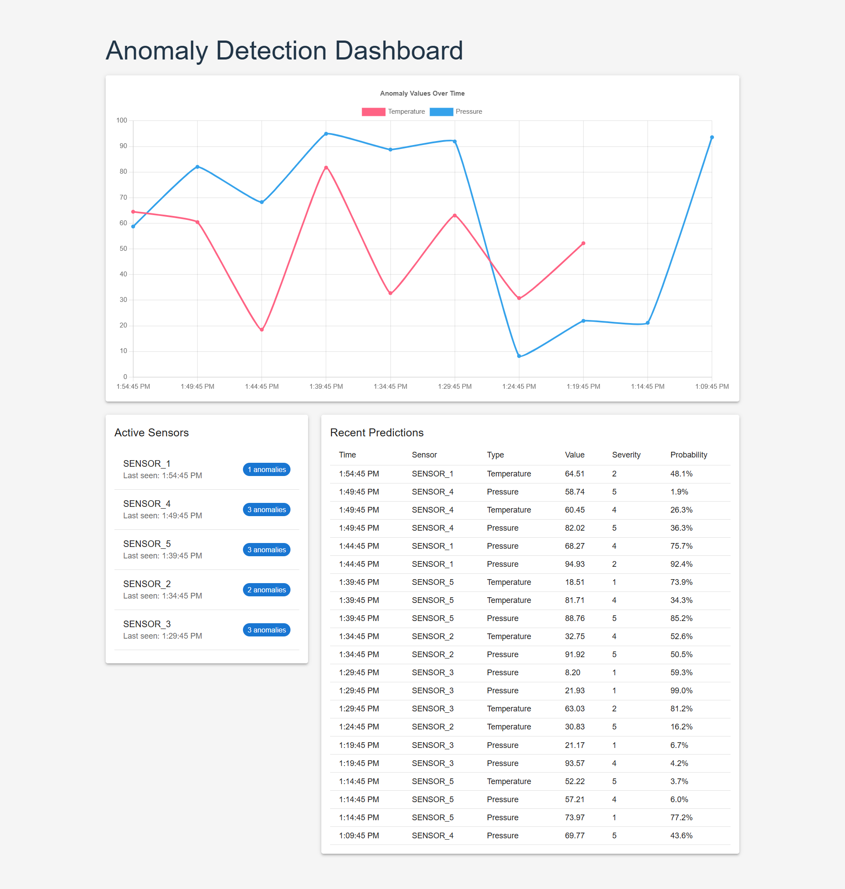

## Preview



## Project Structure

- **Backend**: Node.js/Express API with MongoDB integration
- **Frontend**: React application with Material UI and Chart.js

## Key Architecture Decisions

1. **Database**: MongoDB for storing prediction data
2. **Authentication**: JWT-based authentication for API endpoints
3. **Real-time updates**: Polling mechanism in frontend for near real-time updates
4. **Mock ML**: Simulated ML predictions for demonstration purposes
5. **Responsive UI**: Material UI components for modern, responsive interface

## Setup Instructions

### Backend Setup

1. Navigate to the backend directory:

   ```
   cd backend
   ```

2. Install dependencies:

   ```
   npm install
   ```

3. Configure environment variables in .env file:

   - Ensure MongoDB is running locally or update connection string
   - Set JWT_SECRET for authentication

4. Start the server:
   ```
   npm run dev
   ```

### Frontend Setup

1. Navigate to the frontend directory:

   ```
   cd frontend
   ```

2. Install dependencies:

   ```
   npm install
   ```

3. Start the development server:
   ```
   npm run dev
   ```

## Testing the Application

1. Generate test data by running:

   ```
   cd backend
   node scripts/generateTestData.js
   ```

2. Simulate ML predictions:

   ```
   node scripts/simulateML.js
   ```

3. Access the frontend at `http://localhost:5173`

## Deployment

### Backend Deployment

1. Set up MongoDB on your production server or use a cloud service
2. Update .env with production settings
3. Build and deploy using your preferred hosting service

### Frontend Deployment

1. Build the production bundle:
   ```
   cd frontend
   npm run build
   ```
2. Deploy the resulting `dist` folder to a static hosting service

## API Endpoints

- `GET /ml/predictions` - Fetch stored anomaly predictions
- `POST /ml/predict` - Submit sensor data for prediction
- `GET /api/anomalies` - Fetch historical anomaly data
